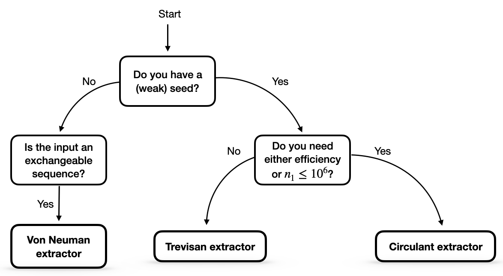

Selecting a Randomness Extractor
================================
In general, the choice of randomness extractor depends on the scenario in which it is used, and it is not always clear which extractor is best suited to a given situation. 
Here, we informally summarize the information from the 'Overview of Extractor Library' in [For2024]_, which assists a user in selecting the best randomness extractor for their task.

If a user begins with some extractor input of length :math:`n_1` with :term:`min-entropy` :math:`k_1`, the flowchart below provides a useful guide for selecting an appropriate extractor.

This flowchart gives a good general approach to follow, however, some improvements can be obtained by analyzing each extractor individually.
The maximum output length for each extractor in different security models is detailed in the following table, 
where :math:`n_2` and :math:`k_2` denote the length and min-entropy of the (weak) seed, respectively and :math:`\epsilon` the extractor error.

.. image:: figures/Table.png
   :width: 600

The derivation of these parameters and all relevant proofs can be found in [For2024]_.