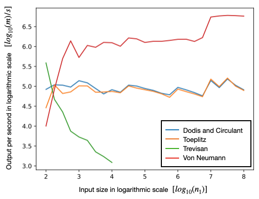

Performance
==========

To demonstrate the capabilities of :py:mod:`cryptomite`, we perform some benchmarking on a MacBook Pro personal laptop (with 2 GHz quad-core Intel i5 processor with 16GB RAM).
The varying degrees of computational efficiency for the extractors of :py:mod:`cryptomite` are evidenced in the following Figure. 

Some observations performance observations are:

* The :py:func:`.von_neumann` extractor is able to output at speeds above 7Mbit/s. 
* The :py:class:`.Circulant`, :py:class:`.Dodis` and :py:class:`.Toeplitz` extractors are able to output at speeds of up to 1Mbit/s. The generation speed is faster for shorter input lengths.
* The :py:class:`.Trevisan` extractor can generate output at speeds comparable to the :py:class:`.Toeplitz` and :py:class:`.Dodis` extractors only when the input size is extremely short. 
* The :py:class:`.Trevisan` extractor unable to generate a non-vanishing bits/second rate for input lengths greater than approximately 30,000.
